<center><h1> X Ray Types of Pneumonia Detection</h1></center>
<center><h3> Model Image description</h3></center>


<center>


```python
import pandas as pd
import matplotlib.pyplot as plt
import matplotlib.image as immg
import numpy as np
from fastai.vision import *
import seaborn as sns;
import gc;
```


```python
sns.set_style('darkgrid')
```


```python
from google.colab import drive
drive.mount('/content/drive')
```


```python
!unzip '/content/drive/My Drive/Dataset/XRay_pnemonia_train.zip' -d '/content/x_ray_covid/'
```


```python
df = pd.read_csv('/content/Xray_pneumonia_data.csv')
```


```python
df.head()
```


<div>
<style scoped>
    .dataframe tbody tr th:only-of-type {
        vertical-align: middle;
    }

    .dataframe tbody tr th {
        vertical-align: top;
    }

    .dataframe thead th {
        text-align: right;
    }
</style>
<table border="1" class="dataframe">
  <thead>
    <tr style="text-align: right;">
      <th></th>
      <th>Unnamed: 0</th>
      <th>X_ray_image_name</th>
      <th>Label</th>
      <th>Dataset_type</th>
      <th>Label_2_Virus_category</th>
      <th>Label_1_Virus_category</th>
      <th>file_name</th>
      <th>image_format</th>
      <th>valid</th>
    </tr>
  </thead>
  <tbody>
    <tr>
      <th>0</th>
      <td>0</td>
      <td>IM-0128-0001.jpeg</td>
      <td>Normal</td>
      <td>TRAIN</td>
      <td>NaN</td>
      <td>NaN</td>
      <td>IM-0128-0001</td>
      <td>jpeg</td>
      <td>False</td>
    </tr>
    <tr>
      <th>1</th>
      <td>1</td>
      <td>IM-0127-0001.jpeg</td>
      <td>Normal</td>
      <td>TRAIN</td>
      <td>NaN</td>
      <td>NaN</td>
      <td>IM-0127-0001</td>
      <td>jpeg</td>
      <td>False</td>
    </tr>
    <tr>
      <th>2</th>
      <td>2</td>
      <td>IM-0125-0001.jpeg</td>
      <td>Normal</td>
      <td>TRAIN</td>
      <td>NaN</td>
      <td>NaN</td>
      <td>IM-0125-0001</td>
      <td>jpeg</td>
      <td>False</td>
    </tr>
    <tr>
      <th>3</th>
      <td>3</td>
      <td>IM-0122-0001.jpeg</td>
      <td>Normal</td>
      <td>TRAIN</td>
      <td>NaN</td>
      <td>NaN</td>
      <td>IM-0122-0001</td>
      <td>jpeg</td>
      <td>False</td>
    </tr>
    <tr>
      <th>4</th>
      <td>4</td>
      <td>IM-0119-0001.jpeg</td>
      <td>Normal</td>
      <td>TRAIN</td>
      <td>NaN</td>
      <td>NaN</td>
      <td>IM-0119-0001</td>
      <td>jpeg</td>
      <td>False</td>
    </tr>
  </tbody>
</table>
</div>


```python
pne = df.loc[df['Label_1_Virus_category'].isnull()==False];pne.head()
```


<div>
<style scoped>
    .dataframe tbody tr th:only-of-type {
        vertical-align: middle;
    }

    .dataframe tbody tr th {
        vertical-align: top;
    }

    .dataframe thead th {
        text-align: right;
    }
</style>
<table border="1" class="dataframe">
  <thead>
    <tr style="text-align: right;">
      <th></th>
      <th>Unnamed: 0</th>
      <th>X_ray_image_name</th>
      <th>Label</th>
      <th>Dataset_type</th>
      <th>Label_2_Virus_category</th>
      <th>Label_1_Virus_category</th>
      <th>file_name</th>
      <th>image_format</th>
      <th>valid</th>
    </tr>
  </thead>
  <tbody>
    <tr>
      <th>1341</th>
      <td>1341</td>
      <td>person101_virus_188.jpeg</td>
      <td>Pnemonia</td>
      <td>TRAIN</td>
      <td>NaN</td>
      <td>Virus</td>
      <td>person101_virus_188</td>
      <td>jpeg</td>
      <td>False</td>
    </tr>
    <tr>
      <th>1342</th>
      <td>1342</td>
      <td>person101_virus_187.jpeg</td>
      <td>Pnemonia</td>
      <td>TRAIN</td>
      <td>NaN</td>
      <td>Virus</td>
      <td>person101_virus_187</td>
      <td>jpeg</td>
      <td>False</td>
    </tr>
    <tr>
      <th>1343</th>
      <td>1343</td>
      <td>person1019_virus_1708.jpeg</td>
      <td>Pnemonia</td>
      <td>TRAIN</td>
      <td>NaN</td>
      <td>Virus</td>
      <td>person1019_virus_1708</td>
      <td>jpeg</td>
      <td>False</td>
    </tr>
    <tr>
      <th>1344</th>
      <td>1344</td>
      <td>person1019_virus_1707.jpeg</td>
      <td>Pnemonia</td>
      <td>TRAIN</td>
      <td>NaN</td>
      <td>Virus</td>
      <td>person1019_virus_1707</td>
      <td>jpeg</td>
      <td>False</td>
    </tr>
    <tr>
      <th>1345</th>
      <td>1345</td>
      <td>person1019_bacteria_2950.jpeg</td>
      <td>Pnemonia</td>
      <td>TRAIN</td>
      <td>NaN</td>
      <td>bacteria</td>
      <td>person1019_bacteria_2950</td>
      <td>jpeg</td>
      <td>False</td>
    </tr>
  </tbody>
</table>
</div>


```python
pne.shape,df.shape
```


    ((4332, 9), (5908, 9))


```python
plt.figure(1,figsize=(12,6))
sns.countplot(x=df.Dataset_type,hue=df.Label)
plt.title('Checking training and valid set distribution');
```


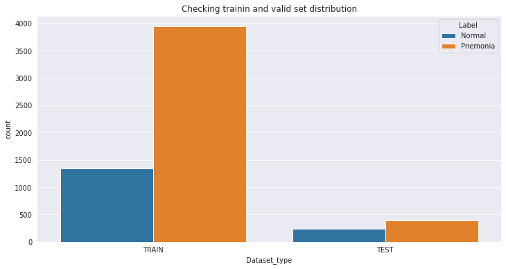


```python
df.valid.value_counts()
```


    False    5284
    True      624
    Name: valid, dtype: int64


```python

```


```python
path = Path('/content/')
```

## First model will be trained for just normal and pneumonia


```python
data_NP = (ImageList.from_df(df,path,folder='x_ray_covid',suffix='.jpg',cols='file_name')
                .split_from_df(col='valid')
                .label_from_df(cols='Label')
                .transform(get_transforms(do_flip=True),size=256)
                .databunch(bs=64)).normalize(imagenet_stats)
```


```python
data_NP.show_batch(rows=3,figsize=(20,8))
```


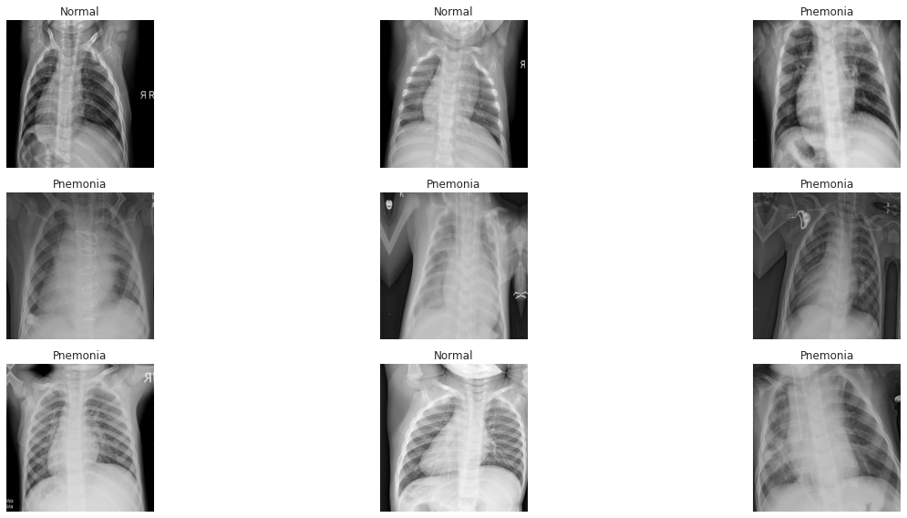


```python
data_NP.classes,len(data_NP.train_ds),len(data_NP.valid_ds)
```


    (['Normal', 'Pnemonia'], 5284, 624)


## Metrics
* Fbeta
* Recall
* Precision
* Kappa Score


```python
fb = FBeta()
fb.average = 'micro'
rec = Recall()
rec.average = 'micro'
Prc = Precision()
Prc.average = 'micro'
kappa = KappaScore()
kappa.weights = "quadratic"
```


```python
met = [fb,rec,Prc,kappa]
```

### Architecture


```python
arch = models.resnet50
```


```python
learn_np = cnn_learner(data_NP, arch, metrics = met,model_dir='/content/') 
```

    Downloading: "https://download.pytorch.org/models/resnet50-19c8e357.pth" to /root/.cache/torch/checkpoints/resnet50-19c8e357.pth
    


    HBox(children=(FloatProgress(value=0.0, max=102502400.0), HTML(value='')))


    
    


```python
learn_np.lr_find()
learn_np.recorder.plot()
```


    <div>
        <style>
            /* Turns off some styling */
            progress {
                /* gets rid of default border in Firefox and Opera. */
                border: none;
                /* Needs to be in here for Safari polyfill so background images work as expected. */
                background-size: auto;
            }
            .progress-bar-interrupted, .progress-bar-interrupted::-webkit-progress-bar {
                background: #F44336;
            }
        </style>
      <progress value='1' class='' max='2' style='width:300px; height:20px; vertical-align: middle;'></progress>
      50.00% [1/2 01:44<01:44]
    </div>

<table border="1" class="dataframe">
  <thead>
    <tr style="text-align: left;">
      <th>epoch</th>
      <th>train_loss</th>
      <th>valid_loss</th>
      <th>f_beta</th>
      <th>recall</th>
      <th>precision</th>
      <th>kappa_score</th>
      <th>time</th>
    </tr>
  </thead>
  <tbody>
    <tr>
      <td>0</td>
      <td>1.225322</td>
      <td>#na#</td>
      <td>01:44</td>
    </tr>
  </tbody>
</table><p>

    <div>
        <style>
            /* Turns off some styling */
            progress {
                /* gets rid of default border in Firefox and Opera. */
                border: none;
                /* Needs to be in here for Safari polyfill so background images work as expected. */
                background-size: auto;
            }
            .progress-bar-interrupted, .progress-bar-interrupted::-webkit-progress-bar {
                background: #F44336;
            }
        </style>
      <progress value='3' class='' max='82' style='width:300px; height:20px; vertical-align: middle;'></progress>
      3.66% [3/82 00:05<02:19 2.4850]
    </div>


    LR Finder is complete, type {learner_name}.recorder.plot() to see the graph.
    


```python
gc.collect()
```


    140


```python
learn_np.fit_one_cycle(6,slice(1e-2,1e-1),moms=0.9)
```


<table border="1" class="dataframe">
  <thead>
    <tr style="text-align: left;">
      <th>epoch</th>
      <th>train_loss</th>
      <th>valid_loss</th>
      <th>f_beta</th>
      <th>recall</th>
      <th>precision</th>
      <th>kappa_score</th>
      <th>time</th>
    </tr>
  </thead>
  <tbody>
    <tr>
      <td>0</td>
      <td>0.391348</td>
      <td>1.731581</td>
      <td>0.813688</td>
      <td>0.814957</td>
      <td>0.809547</td>
      <td>0.624047</td>
      <td>01:52</td>
    </tr>
    <tr>
      <td>1</td>
      <td>0.290632</td>
      <td>0.496275</td>
      <td>0.876665</td>
      <td>0.879060</td>
      <td>0.869493</td>
      <td>0.747262</td>
      <td>01:49</td>
    </tr>
    <tr>
      <td>2</td>
      <td>0.251191</td>
      <td>0.587117</td>
      <td>0.867018</td>
      <td>0.862821</td>
      <td>0.902737</td>
      <td>0.754667</td>
      <td>01:51</td>
    </tr>
    <tr>
      <td>3</td>
      <td>0.192814</td>
      <td>1.133299</td>
      <td>0.739965</td>
      <td>0.741026</td>
      <td>0.873269</td>
      <td>0.536122</td>
      <td>01:50</td>
    </tr>
    <tr>
      <td>4</td>
      <td>0.104282</td>
      <td>0.551351</td>
      <td>0.800654</td>
      <td>0.797436</td>
      <td>0.892708</td>
      <td>0.644444</td>
      <td>01:52</td>
    </tr>
    <tr>
      <td>5</td>
      <td>0.069853</td>
      <td>0.394998</td>
      <td>0.869974</td>
      <td>0.864957</td>
      <td>0.925364</td>
      <td>0.769369</td>
      <td>01:52</td>
    </tr>
  </tbody>
</table>


```python
learn_np.show_results(rows=3)
```


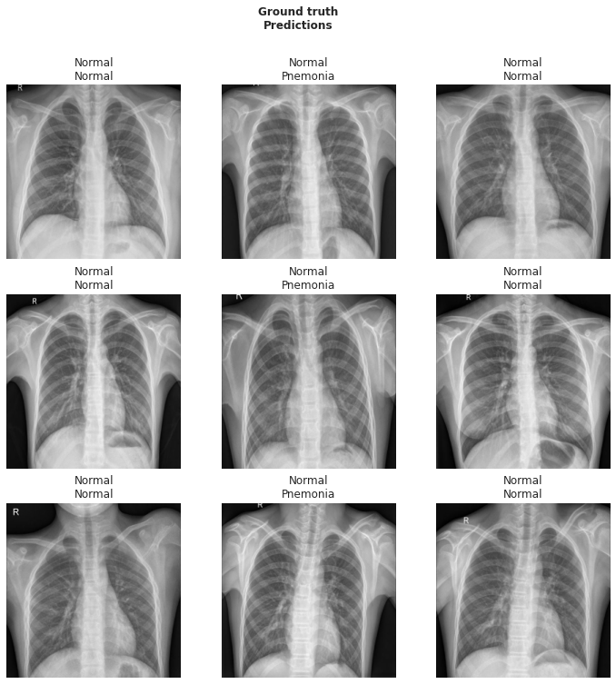


```python
interp = ClassificationInterpretation.from_learner(learn_np)
```


```python
interp.plot_confusion_matrix()
```


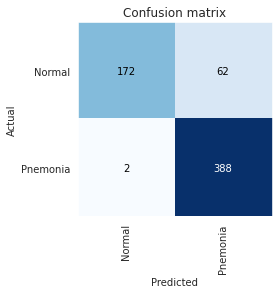


```python
interp.plot_top_losses(k=9,figsize=(20,12),heatmap=True)
```


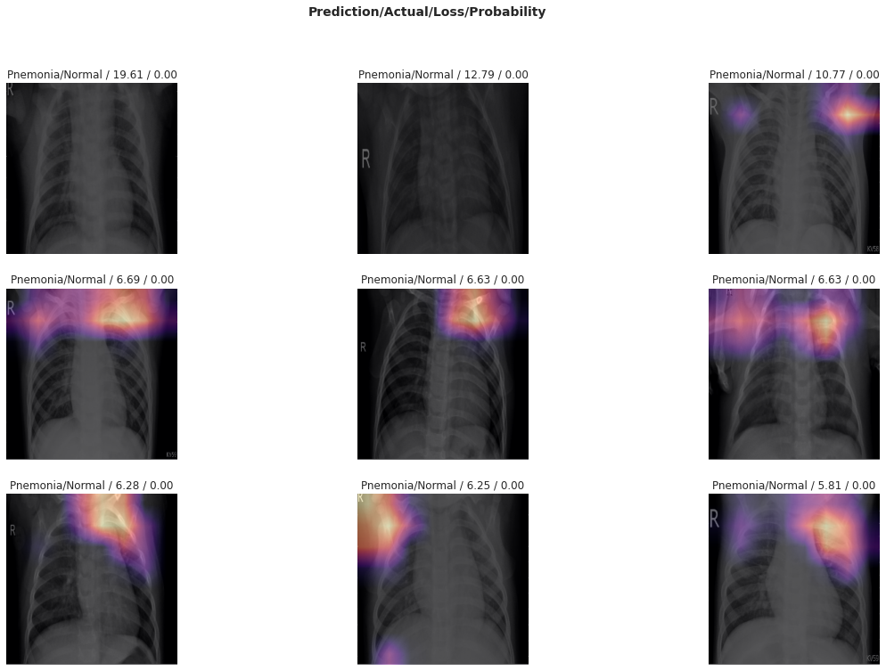


### Time to fine tune the model


```python
learn_np.save('model1np')
```


```python
learn_np.load('model1np');
```


```python
learn_np.export('nor_pne.pkl')
```


```python
!cp '/content/nor_pne.pkl' '/content/drive/My Drive/Dataset/'
```


```python
learn_np.unfreeze()
```


```python
learn_np.lr_find()
learn_np.recorder.plot()
```


    <div>
        <style>
            /* Turns off some styling */
            progress {
                /* gets rid of default border in Firefox and Opera. */
                border: none;
                /* Needs to be in here for Safari polyfill so background images work as expected. */
                background-size: auto;
            }
            .progress-bar-interrupted, .progress-bar-interrupted::-webkit-progress-bar {
                background: #F44336;
            }
        </style>
      <progress value='0' class='' max='2' style='width:300px; height:20px; vertical-align: middle;'></progress>
      0.00% [0/2 00:00<00:00]
    </div>

<table border="1" class="dataframe">
  <thead>
    <tr style="text-align: left;">
      <th>epoch</th>
      <th>train_loss</th>
      <th>valid_loss</th>
      <th>f_beta</th>
      <th>recall</th>
      <th>precision</th>
      <th>kappa_score</th>
      <th>time</th>
    </tr>
  </thead>
  <tbody>
  </tbody>
</table><p>

    <div>
        <style>
            /* Turns off some styling */
            progress {
                /* gets rid of default border in Firefox and Opera. */
                border: none;
                /* Needs to be in here for Safari polyfill so background images work as expected. */
                background-size: auto;
            }
            .progress-bar-interrupted, .progress-bar-interrupted::-webkit-progress-bar {
                background: #F44336;
            }
        </style>
      <progress value='80' class='' max='82' style='width:300px; height:20px; vertical-align: middle;'></progress>
      97.56% [80/82 02:08<00:03 0.1858]
    </div>


    LR Finder is complete, type {learner_name}.recorder.plot() to see the graph.
    


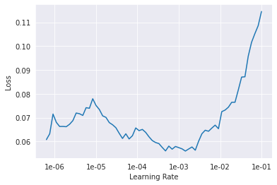


```python
gc.collect()
```


    6415


```python
learn_np.fit_one_cycle(4,slice(1e-5,1e-4))
```


<table border="1" class="dataframe">
  <thead>
    <tr style="text-align: left;">
      <th>epoch</th>
      <th>train_loss</th>
      <th>valid_loss</th>
      <th>f_beta</th>
      <th>recall</th>
      <th>precision</th>
      <th>kappa_score</th>
      <th>time</th>
    </tr>
  </thead>
  <tbody>
    <tr>
      <td>0</td>
      <td>0.059962</td>
      <td>0.402226</td>
      <td>0.869974</td>
      <td>0.864957</td>
      <td>0.925364</td>
      <td>0.769369</td>
      <td>02:20</td>
    </tr>
    <tr>
      <td>1</td>
      <td>0.054365</td>
      <td>0.387450</td>
      <td>0.880652</td>
      <td>0.875641</td>
      <td>0.930368</td>
      <td>0.788341</td>
      <td>02:20</td>
    </tr>
    <tr>
      <td>2</td>
      <td>0.054327</td>
      <td>0.439949</td>
      <td>0.850554</td>
      <td>0.845726</td>
      <td>0.916597</td>
      <td>0.734787</td>
      <td>02:20</td>
    </tr>
    <tr>
      <td>3</td>
      <td>0.054083</td>
      <td>0.398011</td>
      <td>0.865681</td>
      <td>0.860684</td>
      <td>0.923390</td>
      <td>0.761733</td>
      <td>02:19</td>
    </tr>
  </tbody>
</table>


```python
learn_np.unfreeze()
#learn_np.freeze_to(-2)
learn_np.fit_one_cycle(4,slice(1e-3/2))
```


<table border="1" class="dataframe">
  <thead>
    <tr style="text-align: left;">
      <th>epoch</th>
      <th>train_loss</th>
      <th>valid_loss</th>
      <th>f_beta</th>
      <th>recall</th>
      <th>precision</th>
      <th>kappa_score</th>
      <th>time</th>
    </tr>
  </thead>
  <tbody>
    <tr>
      <td>0</td>
      <td>0.064604</td>
      <td>0.475637</td>
      <td>0.838785</td>
      <td>0.834188</td>
      <td>0.914217</td>
      <td>0.714808</td>
      <td>02:19</td>
    </tr>
    <tr>
      <td>1</td>
      <td>0.061696</td>
      <td>0.360353</td>
      <td>0.876390</td>
      <td>0.871368</td>
      <td>0.928355</td>
      <td>0.780773</td>
      <td>02:19</td>
    </tr>
    <tr>
      <td>2</td>
      <td>0.048246</td>
      <td>0.319706</td>
      <td>0.882777</td>
      <td>0.877778</td>
      <td>0.931381</td>
      <td>0.792115</td>
      <td>02:20</td>
    </tr>
    <tr>
      <td>3</td>
      <td>0.039133</td>
      <td>0.367694</td>
      <td>0.884141</td>
      <td>0.879060</td>
      <td>0.934285</td>
      <td>0.795516</td>
      <td>02:19</td>
    </tr>
  </tbody>
</table>


```python
learn_np.export('x_raynp_fb88.pkl')
```


```python
!cp '/content/x_raynp_fb88.pkl' '/content/drive/My Drive/Dataset/'
```


```python
interp = ClassificationInterpretation.from_learner(learn_np)
```


```python
interp.plot_confusion_matrix()
```


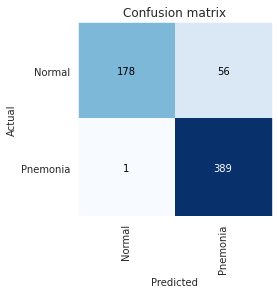


## Now further train model for types of pneumonia


```python
pne.head()
```


<div>
<style scoped>
    .dataframe tbody tr th:only-of-type {
        vertical-align: middle;
    }

    .dataframe tbody tr th {
        vertical-align: top;
    }

    .dataframe thead th {
        text-align: right;
    }
</style>
<table border="1" class="dataframe">
  <thead>
    <tr style="text-align: right;">
      <th></th>
      <th>Unnamed: 0</th>
      <th>X_ray_image_name</th>
      <th>Label</th>
      <th>Dataset_type</th>
      <th>Label_2_Virus_category</th>
      <th>Label_1_Virus_category</th>
      <th>file_name</th>
      <th>image_format</th>
      <th>valid</th>
    </tr>
  </thead>
  <tbody>
    <tr>
      <th>1341</th>
      <td>1341</td>
      <td>person101_virus_188.jpeg</td>
      <td>Pnemonia</td>
      <td>TRAIN</td>
      <td>NaN</td>
      <td>Virus</td>
      <td>person101_virus_188</td>
      <td>jpeg</td>
      <td>False</td>
    </tr>
    <tr>
      <th>1342</th>
      <td>1342</td>
      <td>person101_virus_187.jpeg</td>
      <td>Pnemonia</td>
      <td>TRAIN</td>
      <td>NaN</td>
      <td>Virus</td>
      <td>person101_virus_187</td>
      <td>jpeg</td>
      <td>False</td>
    </tr>
    <tr>
      <th>1343</th>
      <td>1343</td>
      <td>person1019_virus_1708.jpeg</td>
      <td>Pnemonia</td>
      <td>TRAIN</td>
      <td>NaN</td>
      <td>Virus</td>
      <td>person1019_virus_1708</td>
      <td>jpeg</td>
      <td>False</td>
    </tr>
    <tr>
      <th>1344</th>
      <td>1344</td>
      <td>person1019_virus_1707.jpeg</td>
      <td>Pnemonia</td>
      <td>TRAIN</td>
      <td>NaN</td>
      <td>Virus</td>
      <td>person1019_virus_1707</td>
      <td>jpeg</td>
      <td>False</td>
    </tr>
    <tr>
      <th>1345</th>
      <td>1345</td>
      <td>person1019_bacteria_2950.jpeg</td>
      <td>Pnemonia</td>
      <td>TRAIN</td>
      <td>NaN</td>
      <td>bacteria</td>
      <td>person1019_bacteria_2950</td>
      <td>jpeg</td>
      <td>False</td>
    </tr>
  </tbody>
</table>
</div>


```python
plt.figure(1,figsize=(12,6))
sns.countplot(x=pne.Dataset_type,hue=pne.Label_1_Virus_category)
plt.title('Checking training and valid set distribution for different types of pneumonia');
```


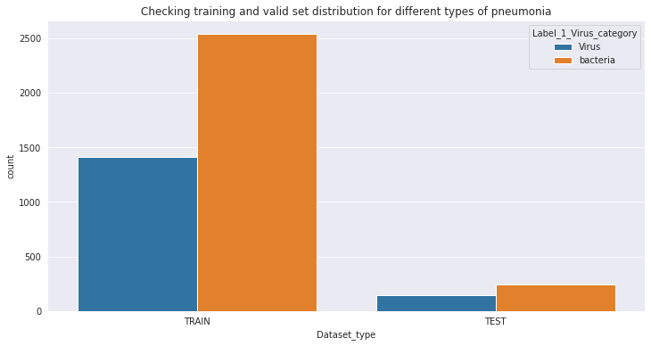


```python
data_p = (ImageList.from_df(pne,path,folder='x_ray_covid',suffix='.jpg',cols='file_name')
                .split_from_df(col='valid')
                .label_from_df(cols='Label_1_Virus_category')
                .transform(get_transforms(do_flip=True),size=256)
                .databunch(bs=64)).normalize(imagenet_stats)
```


```python
data_p.show_batch(rows=3,figsize=(20,8))
```


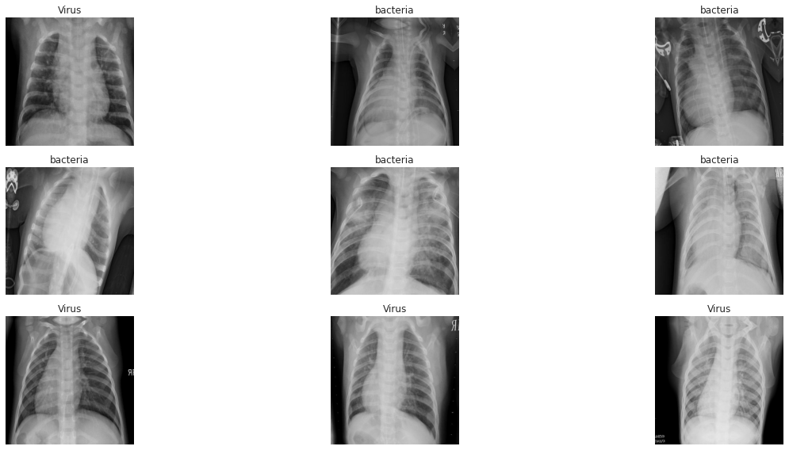


```python
data_p.classes,len(data_p.train_ds),len(data_p.valid_ds)
```


    (['Virus', 'bacteria'], 3942, 390)


* Pneumonia model learner for bacteria and virus


```python
learn_p = cnn_learner(data_p,arch,metrics=met,model_dir='/content/')
```


```python
learn_p.lr_find()
learn_p.recorder.plot()
```


    <div>
        <style>
            /* Turns off some styling */
            progress {
                /* gets rid of default border in Firefox and Opera. */
                border: none;
                /* Needs to be in here for Safari polyfill so background images work as expected. */
                background-size: auto;
            }
            .progress-bar-interrupted, .progress-bar-interrupted::-webkit-progress-bar {
                background: #F44336;
            }
        </style>
      <progress value='1' class='' max='2' style='width:300px; height:20px; vertical-align: middle;'></progress>
      50.00% [1/2 01:15<01:15]
    </div>

<table border="1" class="dataframe">
  <thead>
    <tr style="text-align: left;">
      <th>epoch</th>
      <th>train_loss</th>
      <th>valid_loss</th>
      <th>f_beta</th>
      <th>recall</th>
      <th>precision</th>
      <th>kappa_score</th>
      <th>time</th>
    </tr>
  </thead>
  <tbody>
    <tr>
      <td>0</td>
      <td>1.255408</td>
      <td>#na#</td>
      <td>01:15</td>
    </tr>
  </tbody>
</table><p>

    <div>
        <style>
            /* Turns off some styling */
            progress {
                /* gets rid of default border in Firefox and Opera. */
                border: none;
                /* Needs to be in here for Safari polyfill so background images work as expected. */
                background-size: auto;
            }
            .progress-bar-interrupted, .progress-bar-interrupted::-webkit-progress-bar {
                background: #F44336;
            }
        </style>
      <progress value='29' class='' max='61' style='width:300px; height:20px; vertical-align: middle;'></progress>
      47.54% [29/61 00:38<00:42 3.5779]
    </div>


    LR Finder is complete, type {learner_name}.recorder.plot() to see the graph.
    


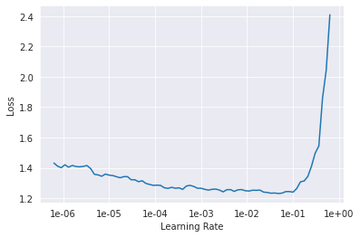


```python
gc.collect()
```


    424


```python
learn_p.fit_one_cycle(6,slice(1e-3,0.055),moms=0.9)
```


<table border="1" class="dataframe">
  <thead>
    <tr style="text-align: left;">
      <th>epoch</th>
      <th>train_loss</th>
      <th>valid_loss</th>
      <th>f_beta</th>
      <th>recall</th>
      <th>precision</th>
      <th>kappa_score</th>
      <th>time</th>
    </tr>
  </thead>
  <tbody>
    <tr>
      <td>0</td>
      <td>0.976600</td>
      <td>1.110036</td>
      <td>0.669766</td>
      <td>0.702703</td>
      <td>0.710893</td>
      <td>0.355490</td>
      <td>01:26</td>
    </tr>
    <tr>
      <td>1</td>
      <td>0.958917</td>
      <td>0.305181</td>
      <td>0.874546</td>
      <td>0.870114</td>
      <td>0.917065</td>
      <td>0.772674</td>
      <td>01:24</td>
    </tr>
    <tr>
      <td>2</td>
      <td>0.662909</td>
      <td>0.275885</td>
      <td>0.911098</td>
      <td>0.910264</td>
      <td>0.914804</td>
      <td>0.824857</td>
      <td>01:24</td>
    </tr>
    <tr>
      <td>3</td>
      <td>0.550020</td>
      <td>0.322565</td>
      <td>0.930187</td>
      <td>0.928105</td>
      <td>0.940908</td>
      <td>0.867595</td>
      <td>01:22</td>
    </tr>
    <tr>
      <td>4</td>
      <td>0.488367</td>
      <td>0.284547</td>
      <td>0.912804</td>
      <td>0.910459</td>
      <td>0.925573</td>
      <td>0.834052</td>
      <td>01:21</td>
    </tr>
    <tr>
      <td>5</td>
      <td>0.446681</td>
      <td>0.283819</td>
      <td>0.908791</td>
      <td>0.905210</td>
      <td>0.932759</td>
      <td>0.832263</td>
      <td>01:21</td>
    </tr>
  </tbody>
</table>


```python
learn_p.save('modelpne')
```


```python
learn_p.load('modelpne');
```


```python
learn_p.unfreeze()
```


```python
learn_p.lr_find()
learn_p.recorder.plot()
```


    <div>
        <style>
            /* Turns off some styling */
            progress {
                /* gets rid of default border in Firefox and Opera. */
                border: none;
                /* Needs to be in here for Safari polyfill so background images work as expected. */
                background-size: auto;
            }
            .progress-bar-interrupted, .progress-bar-interrupted::-webkit-progress-bar {
                background: #F44336;
            }
        </style>
      <progress value='1' class='' max='2' style='width:300px; height:20px; vertical-align: middle;'></progress>
      50.00% [1/2 01:39<01:39]
    </div>

<table border="1" class="dataframe">
  <thead>
    <tr style="text-align: left;">
      <th>epoch</th>
      <th>train_loss</th>
      <th>valid_loss</th>
      <th>f_beta</th>
      <th>recall</th>
      <th>precision</th>
      <th>kappa_score</th>
      <th>time</th>
    </tr>
  </thead>
  <tbody>
    <tr>
      <td>0</td>
      <td>0.490839</td>
      <td>#na#</td>
      <td>01:39</td>
    </tr>
  </tbody>
</table><p>

    <div>
        <style>
            /* Turns off some styling */
            progress {
                /* gets rid of default border in Firefox and Opera. */
                border: none;
                /* Needs to be in here for Safari polyfill so background images work as expected. */
                background-size: auto;
            }
            .progress-bar-interrupted, .progress-bar-interrupted::-webkit-progress-bar {
                background: #F44336;
            }
        </style>
      <progress value='25' class='' max='61' style='width:300px; height:20px; vertical-align: middle;'></progress>
      40.98% [25/61 00:41<01:00 1.2234]
    </div>


    LR Finder is complete, type {learner_name}.recorder.plot() to see the graph.
    


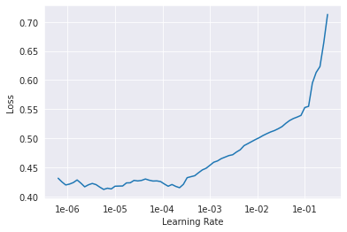


```python
gc.collect()
```


    6486


```python
np.linspace(1e-6,1e-5,5)
```


    array([1.00e-06, 3.25e-06, 5.50e-06, 7.75e-06, 1.00e-05])


```python
learn_p.fit_one_cycle(3,slice(1e-4))
```


<table border="1" class="dataframe">
  <thead>
    <tr style="text-align: left;">
      <th>epoch</th>
      <th>train_loss</th>
      <th>valid_loss</th>
      <th>f_beta</th>
      <th>recall</th>
      <th>precision</th>
      <th>kappa_score</th>
      <th>time</th>
    </tr>
  </thead>
  <tbody>
    <tr>
      <td>0</td>
      <td>0.438973</td>
      <td>0.283062</td>
      <td>0.907579</td>
      <td>0.904456</td>
      <td>0.926950</td>
      <td>0.827370</td>
      <td>01:45</td>
    </tr>
    <tr>
      <td>1</td>
      <td>0.418760</td>
      <td>0.278588</td>
      <td>0.916323</td>
      <td>0.913279</td>
      <td>0.934637</td>
      <td>0.844285</td>
      <td>01:44</td>
    </tr>
    <tr>
      <td>2</td>
      <td>0.414419</td>
      <td>0.280588</td>
      <td>0.914075</td>
      <td>0.911213</td>
      <td>0.930883</td>
      <td>0.838939</td>
      <td>01:44</td>
    </tr>
  </tbody>
</table>


```python
learn_p.save('modelpne_fb91')
```


```python
learn_p.show_results(rows=2)
```


* Interpretation for pneumonia model


```python
interp1 = ClassificationInterpretation.from_learner(learn_p)
```


```python
interp1.plot_confusion_matrix()
```


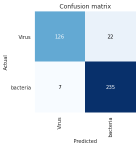


```python
interp1.plot_top_losses(k=9,figsize=(20,12),heatmap=True)
```


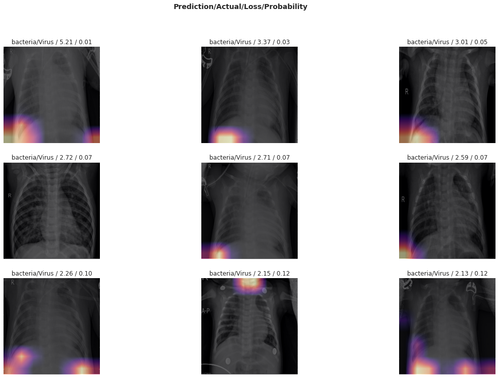


```python
learn_p.export('pne_fb91.pkl')
```


```python
!cp '/content/pne_fb91.pkl' '/content/drive/My Drive/Dataset/'
```

### Lets check the model


```python
df[df['Dataset_type']=='TEST'].sample(n=6)
```


<div>
<style scoped>
    .dataframe tbody tr th:only-of-type {
        vertical-align: middle;
    }

    .dataframe tbody tr th {
        vertical-align: top;
    }

    .dataframe thead th {
        text-align: right;
    }
</style>
<table border="1" class="dataframe">
  <thead>
    <tr style="text-align: right;">
      <th></th>
      <th>Unnamed: 0</th>
      <th>X_ray_image_name</th>
      <th>Label</th>
      <th>Dataset_type</th>
      <th>Label_2_Virus_category</th>
      <th>Label_1_Virus_category</th>
      <th>file_name</th>
      <th>image_format</th>
      <th>valid</th>
    </tr>
  </thead>
  <tbody>
    <tr>
      <th>5586</th>
      <td>5611</td>
      <td>person141_bacteria_676.jpeg</td>
      <td>Pnemonia</td>
      <td>TEST</td>
      <td>NaN</td>
      <td>bacteria</td>
      <td>person141_bacteria_676</td>
      <td>jpeg</td>
      <td>True</td>
    </tr>
    <tr>
      <th>5803</th>
      <td>5828</td>
      <td>person51_virus_105.jpeg</td>
      <td>Pnemonia</td>
      <td>TEST</td>
      <td>NaN</td>
      <td>Virus</td>
      <td>person51_virus_105</td>
      <td>jpeg</td>
      <td>True</td>
    </tr>
    <tr>
      <th>5594</th>
      <td>5619</td>
      <td>person139_bacteria_662.jpeg</td>
      <td>Pnemonia</td>
      <td>TEST</td>
      <td>NaN</td>
      <td>bacteria</td>
      <td>person139_bacteria_662</td>
      <td>jpeg</td>
      <td>True</td>
    </tr>
    <tr>
      <th>5580</th>
      <td>5605</td>
      <td>person142_bacteria_684.jpeg</td>
      <td>Pnemonia</td>
      <td>TEST</td>
      <td>NaN</td>
      <td>bacteria</td>
      <td>person142_bacteria_684</td>
      <td>jpeg</td>
      <td>True</td>
    </tr>
    <tr>
      <th>5357</th>
      <td>5382</td>
      <td>IM-0043-0001.jpeg</td>
      <td>Normal</td>
      <td>TEST</td>
      <td>NaN</td>
      <td>NaN</td>
      <td>IM-0043-0001</td>
      <td>jpeg</td>
      <td>True</td>
    </tr>
    <tr>
      <th>5462</th>
      <td>5487</td>
      <td>NORMAL2-IM-0135-0001.jpeg</td>
      <td>Normal</td>
      <td>TEST</td>
      <td>NaN</td>
      <td>NaN</td>
      <td>NORMAL2-IM-0135-0001</td>
      <td>jpeg</td>
      <td>True</td>
    </tr>
  </tbody>
</table>
</div>


```python
loc = str(path/'x_ray_covid'/df.file_name.iloc[5580])+'.jpg'
img = open_image(loc)
print(data_NP.classes[int(learn_p.predict(img)[0])])
print(data_p.classes[int(learn_p.predict(img)[0])])
img
```

    Pnemonia
    bacteria
    


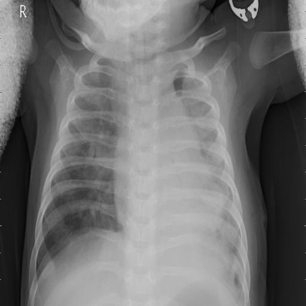


## Plotting a heatmap 


```python
from fastai.callbacks.hooks import *
```


```python
idx=315
x,y = data_NP.valid_ds[idx]
x.show()
data_NP.valid_ds.y[idx]
```


    Category 1


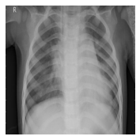


```python
m = learn_np.model.eval()
```


```python
def hooked_backward(cat=y):
    with hook_output(m[0]) as hook_a: 
        with hook_output(m[0], grad=True) as hook_g:
            preds = m(xb)
            preds[0,int(cat)].backward()
    return hook_a,hook_g
```


```python
def show_heatmap(hm):
    _,ax = plt.subplots()
    xb_im.show(ax)
    ax.imshow(hm, alpha=0.6, extent=(0,256,256,0),
              interpolation='bilinear', cmap='magma');
```


```python
xb,_ = data_NP.one_item(x)
xb_im = Image(data_NP.denorm(xb)[0])
xb = xb.cuda()
```


```python
hook_a,hook_g = hooked_backward()
```


```python
acts  = hook_a.stored[0].cpu()
acts.shape

```


    torch.Size([2048, 8, 8])


```python
avg_acts = acts.mean(0)
avg_acts.shape
```


    torch.Size([8, 8])


```python
show_heatmap(avg_acts)
```


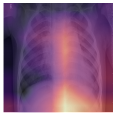


```python
pne.head()
```


<div>
<style scoped>
    .dataframe tbody tr th:only-of-type {
        vertical-align: middle;
    }

    .dataframe tbody tr th {
        vertical-align: top;
    }

    .dataframe thead th {
        text-align: right;
    }
</style>
<table border="1" class="dataframe">
  <thead>
    <tr style="text-align: right;">
      <th></th>
      <th>Unnamed: 0</th>
      <th>X_ray_image_name</th>
      <th>Label</th>
      <th>Dataset_type</th>
      <th>Label_2_Virus_category</th>
      <th>Label_1_Virus_category</th>
      <th>file_name</th>
      <th>image_format</th>
      <th>valid</th>
    </tr>
  </thead>
  <tbody>
    <tr>
      <th>1341</th>
      <td>1341</td>
      <td>person101_virus_188.jpeg</td>
      <td>Pnemonia</td>
      <td>TRAIN</td>
      <td>NaN</td>
      <td>Virus</td>
      <td>person101_virus_188</td>
      <td>jpeg</td>
      <td>False</td>
    </tr>
    <tr>
      <th>1342</th>
      <td>1342</td>
      <td>person101_virus_187.jpeg</td>
      <td>Pnemonia</td>
      <td>TRAIN</td>
      <td>NaN</td>
      <td>Virus</td>
      <td>person101_virus_187</td>
      <td>jpeg</td>
      <td>False</td>
    </tr>
    <tr>
      <th>1343</th>
      <td>1343</td>
      <td>person1019_virus_1708.jpeg</td>
      <td>Pnemonia</td>
      <td>TRAIN</td>
      <td>NaN</td>
      <td>Virus</td>
      <td>person1019_virus_1708</td>
      <td>jpeg</td>
      <td>False</td>
    </tr>
    <tr>
      <th>1344</th>
      <td>1344</td>
      <td>person1019_virus_1707.jpeg</td>
      <td>Pnemonia</td>
      <td>TRAIN</td>
      <td>NaN</td>
      <td>Virus</td>
      <td>person1019_virus_1707</td>
      <td>jpeg</td>
      <td>False</td>
    </tr>
    <tr>
      <th>1345</th>
      <td>1345</td>
      <td>person1019_bacteria_2950.jpeg</td>
      <td>Pnemonia</td>
      <td>TRAIN</td>
      <td>NaN</td>
      <td>bacteria</td>
      <td>person1019_bacteria_2950</td>
      <td>jpeg</td>
      <td>False</td>
    </tr>
  </tbody>
</table>
</div>


```python
print(pne.Label_2_Virus_category.value_counts());
sns.countplot(x=pne.Label_2_Virus_category);
```

    COVID-19         58
    Streptococcus     5
    SARS              4
    Name: Label_2_Virus_category, dtype: int64
    


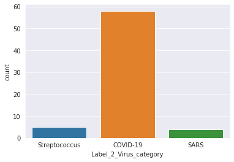


```python
pne['is_covid'] = 0
```


```python
pne.loc[pne['Label_2_Virus_category']=='COVID-19','is_covid'] = 1
```


```python
pne.to_csv('pneumonia.csv',index=False)
```


```python
cov = pd.read_csv('pneumonia.csv')
```


```python
from sklearn.model_selection import StratifiedKFold
```


```python
cov.is_covid.value_counts()
```


    0    4274
    1      58
    Name: is_covid, dtype: int64


```python
cov['kfold'] = -1
cov = cov.sample(frac=1.,random_state=2020).reset_index(drop=True)
y = cov.is_covid.values
kf = StratifiedKFold(n_splits=5)
for fold, (trn_,val_) in enumerate(kf.split(X=cov,y=y)):
  cov.loc[val_,'kfold'] = fold

```

* Lets see we have 11 covid per 855 non covid x-rays
* So I will choose metrocs accordingly. Let's use **AUCROC**


```python
cov[cov.kfold==3].is_covid.value_counts()
```


    0    855
    1     11
    Name: is_covid, dtype: int64


```python
trn_idx,val_idx = list(cov[cov.kfold!=3].index) ,list(cov[cov.kfold==3].index)
```


```python
import random
random.shuffle(trn_idx)
random.shuffle(val_idx)


```


```python
data_cov = (ImageList.from_df(cov,path,folder='x_ray_covid',suffix='.jpg',cols='file_name')
                .split_by_idxs(trn_idx,val_idx)
                .label_from_df(cols='is_covid')
                .transform(get_transforms(do_flip=True),size=256)
                .databunch(bs=64)).normalize(imagenet_stats)
```


```python
data_cov.show_batch(rows=3,ds_type=DatasetType.Valid,figsize=(20,8))
```


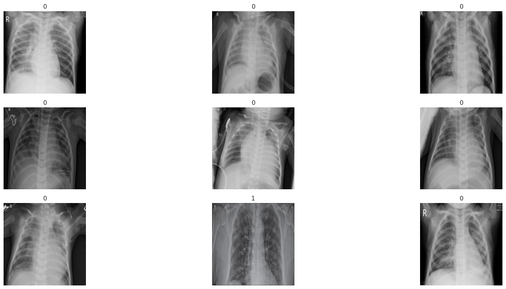


```python
gc.collect()
```


    30117


```python
met = [AUROC(),fb,rec,Prc]
```


```python
learn_cov = cnn_learner(data_cov,models.resnet34,metrics=met,model_dir='/content/')
```


```python
learn_cov.lr_find()
learn_cov.recorder.plot()
```


    <div>
        <style>
            /* Turns off some styling */
            progress {
                /* gets rid of default border in Firefox and Opera. */
                border: none;
                /* Needs to be in here for Safari polyfill so background images work as expected. */
                background-size: auto;
            }
            .progress-bar-interrupted, .progress-bar-interrupted::-webkit-progress-bar {
                background: #F44336;
            }
        </style>
      <progress value='1' class='' max='2' style='width:300px; height:20px; vertical-align: middle;'></progress>
      50.00% [1/2 00:39<00:39]
    </div>

<table border="1" class="dataframe">
  <thead>
    <tr style="text-align: left;">
      <th>epoch</th>
      <th>train_loss</th>
      <th>valid_loss</th>
      <th>auroc</th>
      <th>time</th>
    </tr>
  </thead>
  <tbody>
    <tr>
      <td>0</td>
      <td>1.244262</td>
      <td>#na#</td>
      <td>00:39</td>
    </tr>
  </tbody>
</table><p>

    <div>
        <style>
            /* Turns off some styling */
            progress {
                /* gets rid of default border in Firefox and Opera. */
                border: none;
                /* Needs to be in here for Safari polyfill so background images work as expected. */
                background-size: auto;
            }
            .progress-bar-interrupted, .progress-bar-interrupted::-webkit-progress-bar {
                background: #F44336;
            }
        </style>
      <progress value='39' class='' max='54' style='width:300px; height:20px; vertical-align: middle;'></progress>
      72.22% [39/54 00:29<00:11 1.8965]
    </div>


    LR Finder is complete, type {learner_name}.recorder.plot() to see the graph.
    


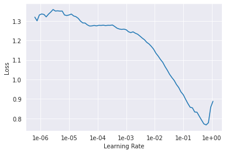


```python
gc.collect()
```


    16


```python
from fastai.callbacks import *
```


```python
callbacks = SaveModelCallback(learn_cov,monitor='auroc',mode='max',every='improvement',name='best_model_covid')
```


```python
learn_cov.fit_one_cycle(6,slice(1e-1),callbacks=[callbacks])
```


<table border="1" class="dataframe">
  <thead>
    <tr style="text-align: left;">
      <th>epoch</th>
      <th>train_loss</th>
      <th>valid_loss</th>
      <th>auroc</th>
      <th>f_beta</th>
      <th>recall</th>
      <th>precision</th>
      <th>time</th>
    </tr>
  </thead>
  <tbody>
    <tr>
      <td>0</td>
      <td>0.279124</td>
      <td>0.062609</td>
      <td>0.997767</td>
      <td>0.995381</td>
      <td>0.995381</td>
      <td>0.995381</td>
      <td>00:47</td>
    </tr>
    <tr>
      <td>1</td>
      <td>0.236834</td>
      <td>0.416237</td>
      <td>0.857310</td>
      <td>0.991917</td>
      <td>0.991917</td>
      <td>0.991917</td>
      <td>00:47</td>
    </tr>
    <tr>
      <td>2</td>
      <td>0.344063</td>
      <td>0.100397</td>
      <td>0.995853</td>
      <td>0.993072</td>
      <td>0.993072</td>
      <td>0.993072</td>
      <td>00:46</td>
    </tr>
    <tr>
      <td>3</td>
      <td>0.313954</td>
      <td>0.165562</td>
      <td>0.989633</td>
      <td>0.991917</td>
      <td>0.991917</td>
      <td>0.991917</td>
      <td>00:46</td>
    </tr>
    <tr>
      <td>4</td>
      <td>0.147719</td>
      <td>0.087443</td>
      <td>0.997235</td>
      <td>0.991917</td>
      <td>0.991917</td>
      <td>0.991917</td>
      <td>00:46</td>
    </tr>
    <tr>
      <td>5</td>
      <td>0.079874</td>
      <td>1.113659</td>
      <td>0.995853</td>
      <td>0.991917</td>
      <td>0.991917</td>
      <td>0.991917</td>
      <td>00:46</td>
    </tr>
  </tbody>
</table>


    Better model found at epoch 0 with auroc value: 0.9977671504020691.
    


```python
valid_cov = cov.iloc[val_idx,:].copy()
```


```python
interp_cov = ClassificationInterpretation.from_learner(learn_cov)
```


```python
interp_cov.plot_confusion_matrix()
```


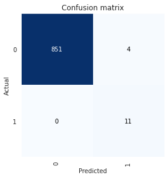


```python
interp_cov.plot_top_losses(k=4,figsize=(20,8))
```


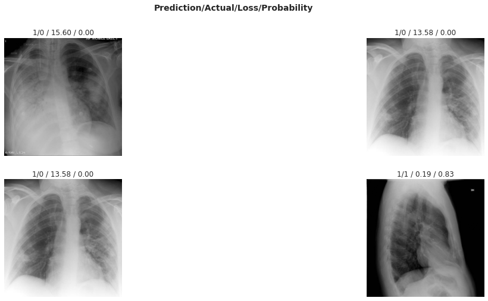


```python
learn_cov.export('x_ray_covid.pkl')
```


```python
!cp '/content/x_ray_covid.pkl' '/content/drive/My Drive/Dataset'
```


```python

```
